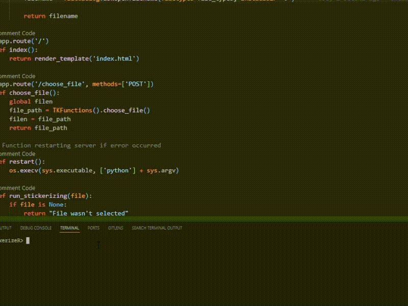

# Stickerizer

**Stickerizer** is a straightforward Python application designed for creating Telegram stickers from input files. It offers the capability to resize and convert both images and videos, optimizing them for use as Telegram stickers.

## Key Features

- Create Telegram stickers using either images or videos.
- Supports various input formats, including JPEG, PNG, MP4, AVI, and more.
- Resizes and processes input files to meet Telegram sticker requirements.
- User-friendly graphical user interface (GUI) for easy operation.

## Installation

1. Clone the repository, download the source code, or obtain the pre-built executable.

2. Install the required Python packages using pip:

```bash
pip install -r requirements.txt

```
3. Run the `stickerizer.py` script to launch the application.

## How to Use



1. Launch the Stickerizer application.

2. Click the "Choose a file to stickerize" button to select an input file (JPEG, PNG, MP4, AVI, etc.).

3. Click the "Start Stickerizing" button to begin the stickerization process. The output will be displayed in the "Output Log" section.

4. The processed image or video will be saved in the "output" folder within the application directory.

## Contributing

If you want to contribute to this project or report issues, please visit the [GitHub repository](https://github.com/yourusername/stickerizer) and submit a pull request or open an issue.

## License

This project is licensed under the GPL-2.0 License. See the [LICENSE](./LICENSE) file for details.
